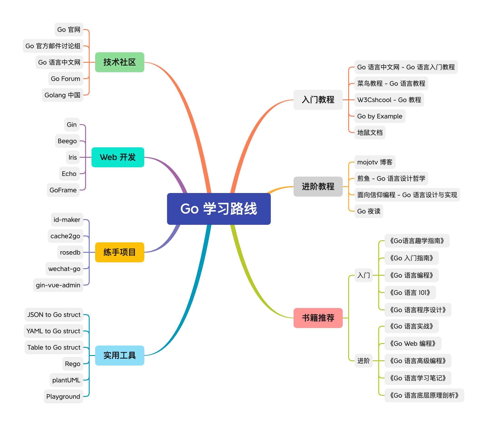

# 1.Go学习路线

# 2.Go学习计划
第一阶段：学习[Go入门指南](https://learnku.com/docs/the-way-to-go/file-name-keyword-and-identifier/3582)，掌握Go的基础语法和常用库的用法；

第二阶段：复习数据结构、常用排序和搜索算法，使用Go实现一下；

第三阶段：学习Go的Web开发，包括基本库的使用、搭建后台服务器等；

第四阶段：使用Go进行Web开发训练，实现一个练手项目；

第五阶段：Go全面复习，针对性训练不熟悉和重要的地方；
